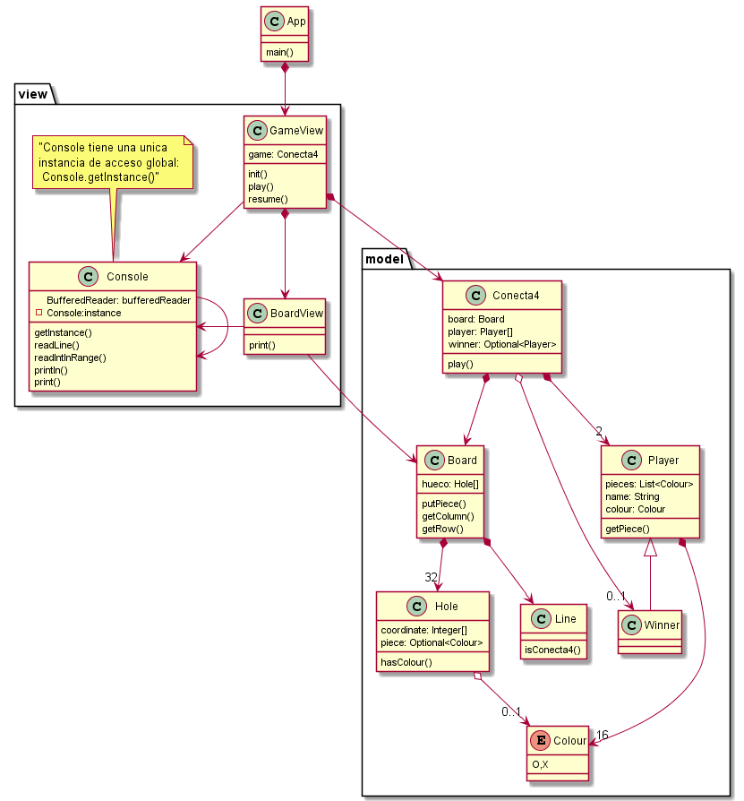

# Conecta 4 Model View

Modelo y vista no puede estar acoplados. La vista tiene el control del flujo de ejecución, hace uso del dominio

## Patrón singleton

Singleton o instancia única es un patrón de diseño que permite restringir la creación de objetos pertenecientes a una clase o el valor de un tipo a un único objeto.

Su intención consiste en garantizar que una clase tenga una **única instancia** y proporcionar un punto de **acceso global** a ella. 