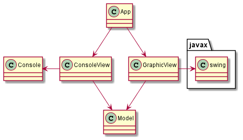
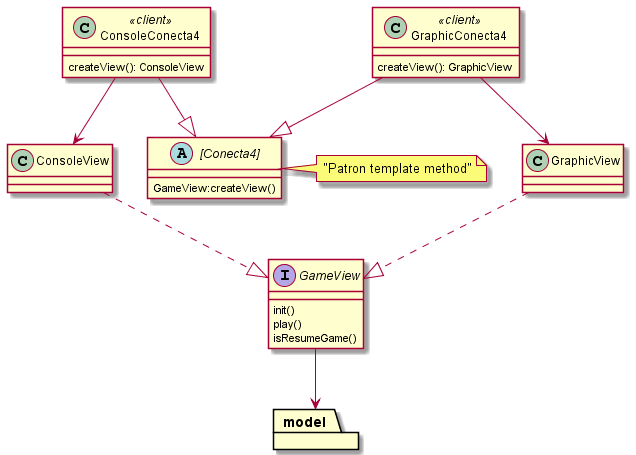

# Conecta 4 Model View 

Modelo y vista no puede estar acoplados. Se desacoplan para que puedan existir distintas vistas: Console y javax.swing

La vista tiene el control del flujo de ejecución, hace uso del modelo.

Se hace uso del patron **factory method** para instanciar la vista en función de la selección tipo de juego: Gráfica o Console 

## Factory method

Factory Method sugiere que, en lugar de llamar al operador new para construir objetos directamente, se invoque a un **método fábrica**. No te preocupes: los objetos
se siguen creando a través del operador new , pero se invocan desde el método fábrica

## Template method

Template Method es un patrón de comportamiento que define el esqueleto de un algoritmo en una operación, difiriendo algunos pasos a las subclases para que éstas puedan redefinirlos sin cambiar la estructura.

