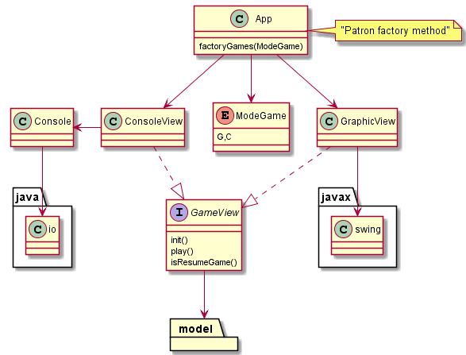

# Conecta 4 Model View 

Modelo y vista no puede estar acoplados. Se desacoplan para que puedan existir distintas vistas: Console y javax.swing

La vista tiene el control del flujo de ejecución, hace uso del modelo.

Se hace uso del patron factory en vez del template method del ejemplo. 

