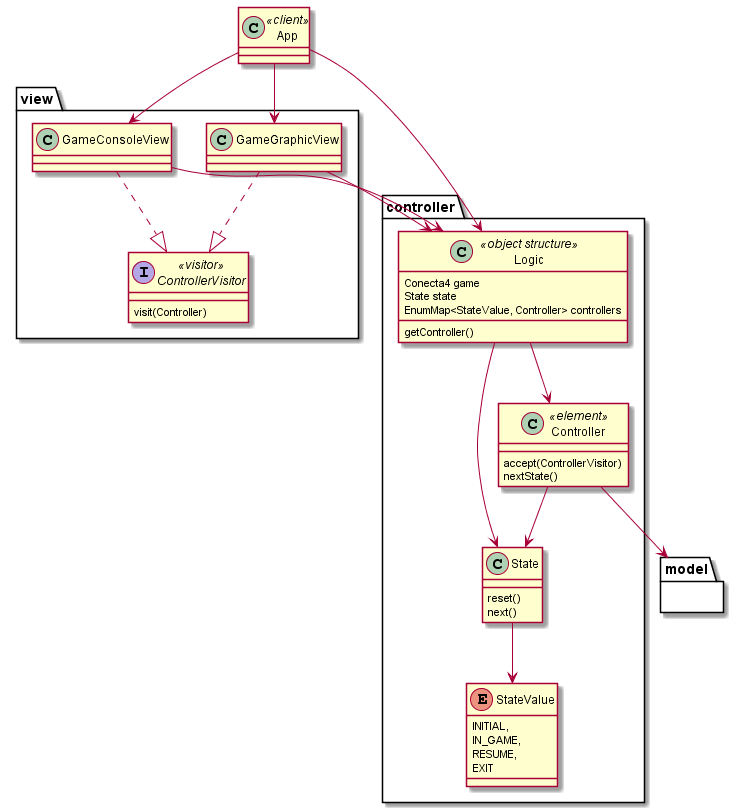

# Conecta 4 Model View Controlador Inversion de control

El control del flujo de la ejecución pasa a los controllers. Los controladores se encargan de llamar al siguiente en funcion de un objeto GameState que define el ciclo de vida del juego.  

### Patron visitor

El patrón visitor es una forma de separar el algoritmo de la estructura de un objeto.

La idea básica es que se tiene un conjunto de clases **elemento** que conforman la **estructura de un objeto**. 
Cada una de estas clases elemento tiene un método aceptar que recibe al objeto **Visitor** como argumento. 
Visitor es una interfaz que tiene un método visit diferente para cada elemento. 
El método accept de una clase elemento llama al método visit de su clase. 
Clases concretas de un visitante pueden entonces ser escritas para hacer una operación en particular.

Cada método visit de un visitante concreto puede ser pensado como un método que no es de una sola clase, sino de un par de clases: el visitante concreto y clase elemento particular. Así el patrón visitor simula el envío doble (en inglés este término se conoce como **Double-Dispatch**) en un lenguaje convencional orientado a objetos de envío único (Single-Dispatch), como son Java o C++.

El patrón visitor también especifica cómo sucede la interacción en la estructura del objeto. En su versión más sencilla, donde cada algoritmo necesita iterar de la misma forma, el método accept de un elemento contenedor, además de una llamada al método visit del objeto visitor, también pasa el objeto visitor como argumento al llamar al método accept de todos sus elementos hijos.

 