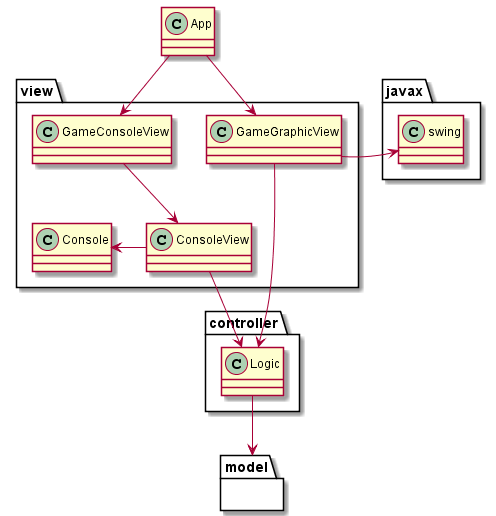

# Conecta 4 Model View Controlador

Los caso de usos devienen en controladores: 

* StartController
* PlayController
* ResumeController

Con la clase Logic sigue el patron Fachada para la capa controller

