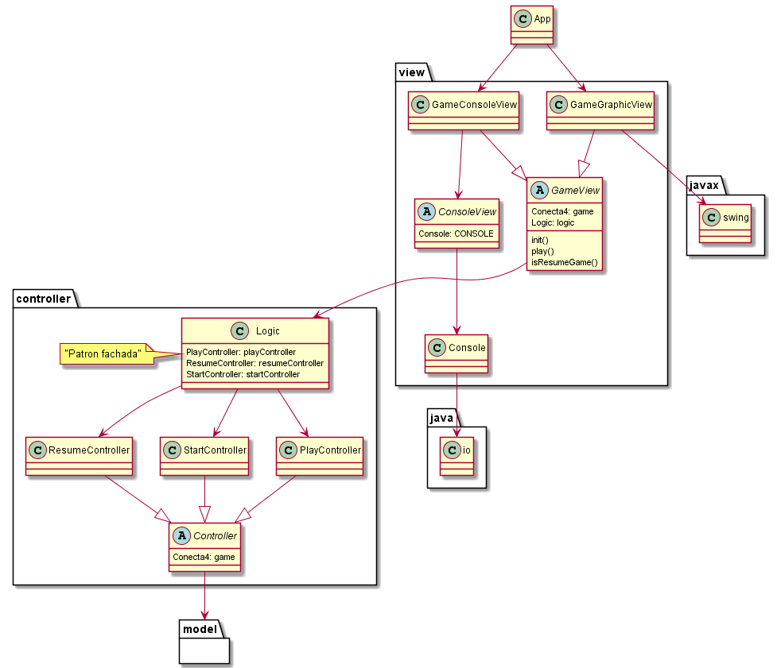

# Conecta 4 Model View Controlador

Los caso de usos devienen en controladores: 

* StartController Petición de nombres de los usuario
* PlayController Petición de la columna y pintar el tablero y finaliza
* ResumeController Reinicio del juego

Con la clase Logic sigue el patron Fachada para la capa controller

## Patron Fachada

Un clase **Facade** delega las peticiones de los clientes en los objetos **SubsystemClass** apropiados, ya que sabe qué clases del subsistema son las responsables ante una petición.

Las SubsystemClass implementan la funcionalidad del subsistema y llevan a cabo las peticiones solicitadas por el objeto Facade, aunque para ellas, el objeto Facade sólo será otro cliente más, al que no conocen y del que no tienen una referencia.

